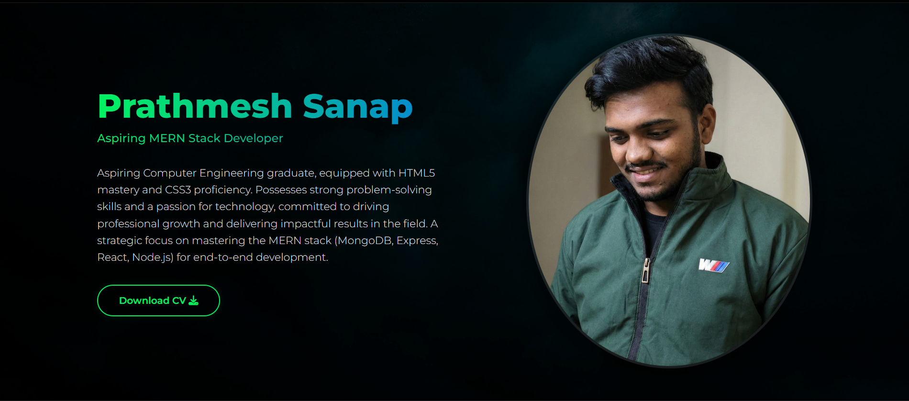

# ⚡ Prathmesh Sanap | Personal Portfolio

<div align="center">
  
</div>

## 🚀 Overview
Welcome to my personal portfolio! This is a fully responsive website designed with a **Neon Glassmorphism** theme to showcase my journey as an **Aspiring Computer Engineering Graduate**. 

It highlights my technical skills, projects, and my path towards mastering the **MERN Stack**.

🔗 **Live Demo:** [Click Here to View Portfolio](https://prathmesh-ally.github.io/My-Portfolio/)

---

## 🛠️ Tech Stack & Skills

This portfolio features a unique **Gamified Skills Section** where skills are categorized based on my proficiency:

| Status | Technology |
|:------:|------------|
| ✅ **Unlocked (Mastered)** | HTML5, CSS3, JavaScript (ES6+), Bootstrap |
| 🔒 **Locked (Learning)** | MongoDB, Express.js, React.js, Node.js (MERN Stack) |

---

## ✨ Key Features

- **🎨 Neon Glassmorphism UI:** Modern dark aesthetics with glowing neon effects and glass-like elements.
- **📱 Fully Responsive:** Optimized for Desktop, Tablet, and Mobile screens.
- **⌨️ Dynamic Typing Effect:** Integrated `Typed.js` in the hero section for an interactive introduction.
- **🚀 Smooth Navigation:** Custom smooth scrolling and interactive hover effects.
- **📄 Downloadable Resume:** Direct access to my latest CV.

---

## 📂 Projects Showcased

### 1. 🎵 Spotify Web Clone
A responsive replica of the Spotify web interface.
- **Tech:** HTML5, CSS3, Bootstrap.
- **Highlights:** Clean UI design mimicking the original platform, mobile-friendly layout.
- [🔗 View Code](https://github.com/Prathmesh-ally/Spotify-clone-Using-Pure-CSS-.git)

### 2. 🏫 Premier Schools Exhibition Landing Page
A high-performance event landing page.
- **Tech:** HTML5, CSS3, Flexbox, Grid.
- **Highlights:** CSS-only infinite scroll animations, modern glassmorphism cards.
- [🔗 View Code](https://github.com/Prathmesh-ally/Assignment-By-SRV-MEDIA-.git)

### 3. 💼 Personal Portfolio (This Website)
- **Tech:** HTML, CSS, JavaScript.
- **Highlights:** Contact form integration, custom animations.

---

## ⚡ How to Run Locally

If you want to view the source code on your local machine:

1. **Clone the repository:**
   ```bash
   git clone [https://github.com/Prathmesh-ally/My-Portfolio.git](https://github.com/Prathmesh-ally/My-Portfolio.git)
